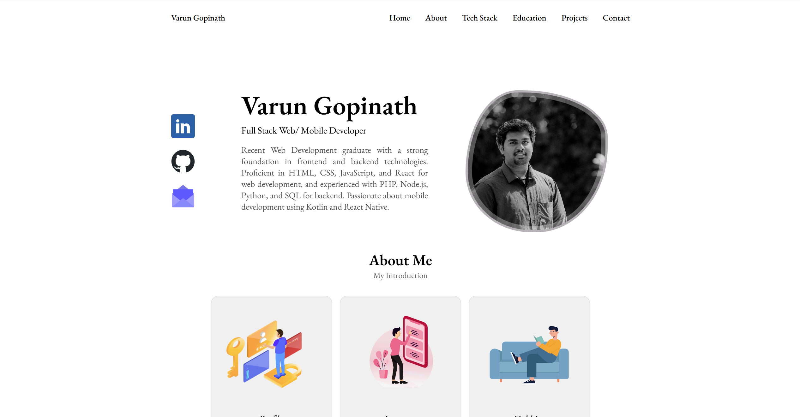

# Varun Gopinath's Portfolio

This is the source code for my personal portfolio website.

## Preview

## Project Details

This portfolio showcases my skills, projects, and experience as a Full Stack Web/Mobile Developer. It includes sections such as About Me, Skills, Education, Projects, and Contact.

### Technologies Used

- **Frontend:** HTML, CSS, JavaScript, React
- **Backend:** Node.js, Express
- **Database:** MongoDB
- **Hosting:** Netlify

## Links

- **Deployed Site:** [Varun Gopinath's Portfolio](https://varungnath.netlify.app/)
- **GitHub Repository:** [GitHub](https://github.com/varungnath/portfolio)
